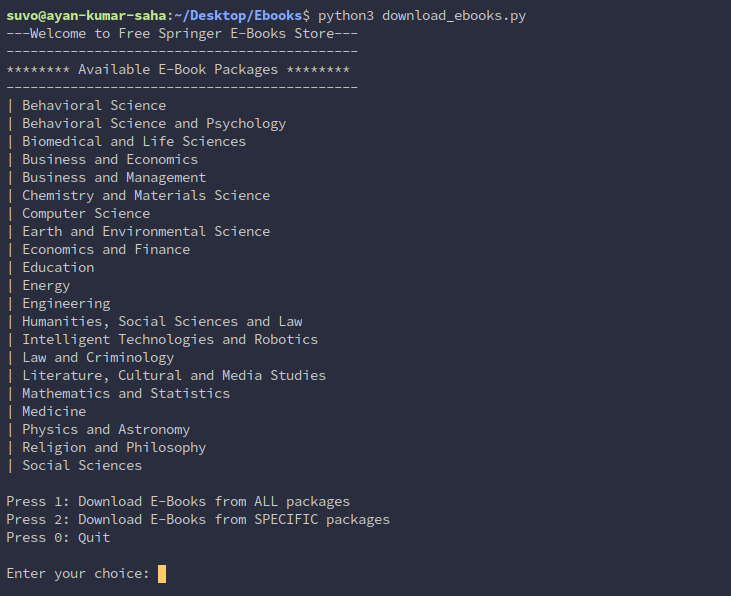
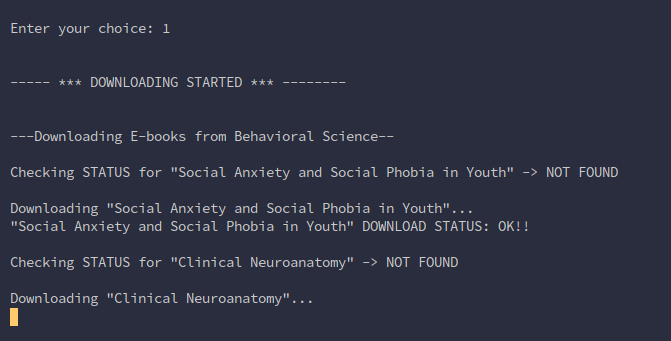
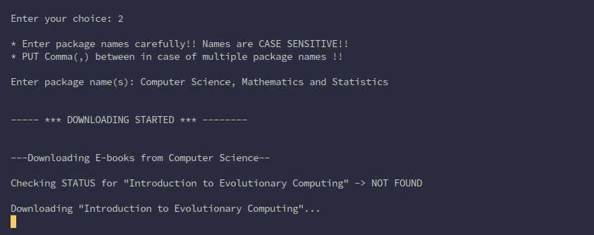
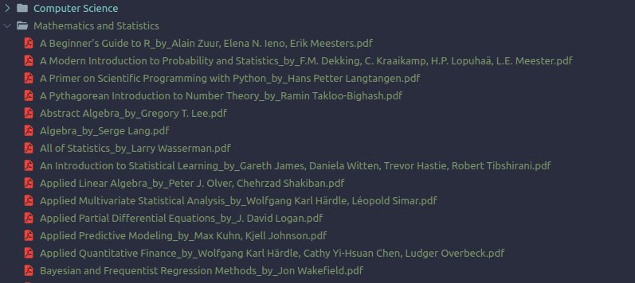

# Free Springer E-books Downloader

A scraper for downloading free Springer e-books.

### Features
* A collection of 400+ e-books from Springer
* No browser required
* No need to manually download and organize
* No re-downloads. Start and stop the downloader anytime, it will download the books from the last checkpoint
* Absolutely hassle-free, run the downloader and wait until it finishes

## Table of Content

* [Prerequisites](#prerequisites)

* [Getting started](#getting-started)

* [Environment setup](#environment-setup)

* [Run E-books Downloader](#run-e-books-downloader)

* [Usage](#usage)

* [Build with](#build-with)

* [Author](#author)

* [License](#license)

## Prerequisites

* **Python 3** and **pip**  

## Getting started

Clone the repository to your local machine using,
 
```
~$ git clone https://github.com/Ayan-Kumar-Saha/Free-Springer-E-books-Downloader.git
```

## Environment setup

To install all dependencies at once, move into project directory and run,


### Linux/macOS 

```
~$ pip3 install -r dependencies.txt
```

### Windows
```
~$ pip install -r dependencies.txt
```

## Run E-books Downloader

Run the downloader using, 

### Linux and macOS

```
~$ python3 download_ebooks.py
```

### Windows

```
~$ python download_ebooks.py
```

## Usage

Once the downloader starts, a list of e-book packages will be displayed



Enter **1** to download all the e-books available from all the packages, download should be started automatically



Enter **2** to download e-books from one or more than one specific packages. Enter the names of the packages as same the list that will be displayed (names are case sensitive). Put comma(,) between the names if more than one packages are there. Again download will be started automatically



## Output

Once completed, check your current directory for the e-books



## Build with

* [BeautifulSoup4](https://pypi.org/project/beautifulsoup4/) - A library that makes it easy to scrape information from web pages. 
* [Requests](https://requests.readthedocs.io/en/master/) - HTTP library for Python

## Author

**Ayan Kumar Saha**
* [GitHub](https://github.com/Ayan-Kumar-Saha)
* [LinkedIn](https://www.linkedin.com/in/ayankumarsaha/)

## License

Copyright © 2020 [Ayan Kumar Saha](https://github.com/Ayan-Kumar-Saha) Released under the [MIT](https://choosealicense.com/licenses/mit/) license.